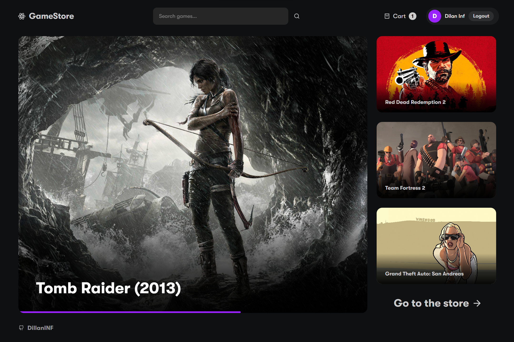
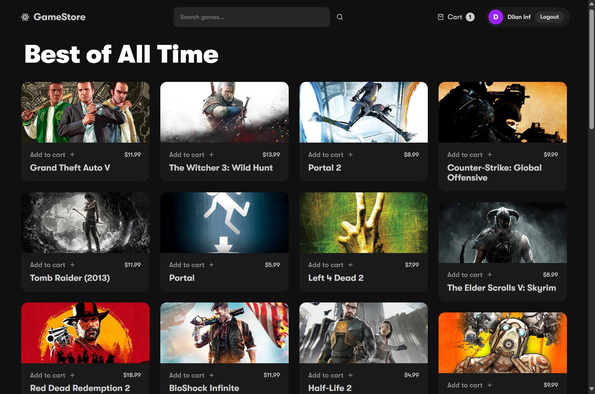
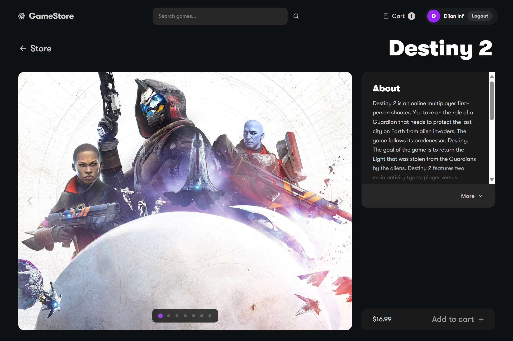
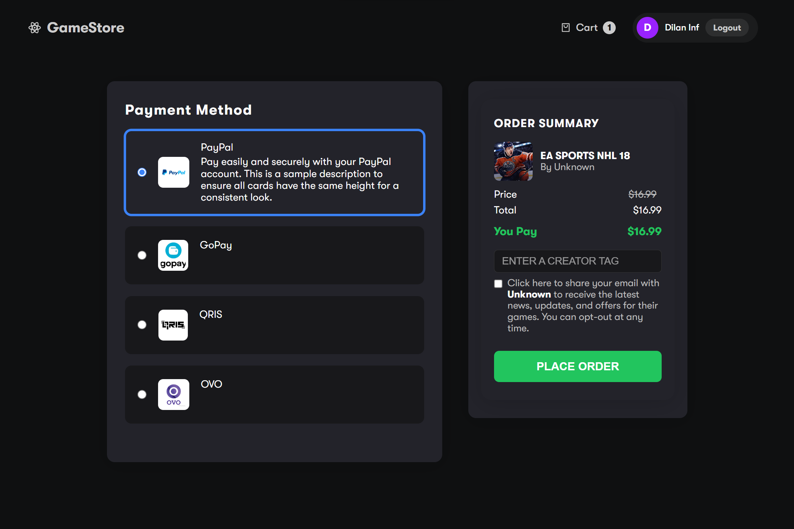

# 🎮 GameStore - Modern Game E-Commerce Platform

A modern, responsive game store web application built with React, TypeScript, and SCSS. Browse games, manage your shopping cart, and complete purchases with an intuitive checkout flow.



## ✨ Features

- 🎯 **Browse Games** - Explore a vast catalog of games with detailed information
- 🔍 **Smart Search** - Quickly find your favorite games
- 🛒 **Shopping Cart** - Add and manage items with persistent storage
- 💳 **Checkout System** - Complete purchases with multiple payment options
- 🔐 **User Authentication** - Login with Google or Facebook
- 📱 **Responsive Design** - Optimized for desktop, tablet, and mobile devices
- 🎨 **Modern UI/UX** - Clean and intuitive interface with smooth animations

## 📸 Screenshots

### Homepage


### Game Details


### Checkout Page


## 🚀 Getting Started

### Prerequisites

- Node.js (v14 or higher)
- npm or yarn
- RAWG API Key (get it from [RAWG API](https://rawg.io/apidocs))

### Installation

1. **Clone the repository**
   ```bash
   git clone https://github.com/DillanINF/Game-Store.git
   cd Game-Store
   ```

2. **Install dependencies**
   ```bash
   npm install
   ```

3. **Setup environment variables**
   ```bash
   # Copy .env.example to .env
   cp .env.example .env
   ```
   
   Then edit `.env` and add your RAWG API key:
   ```env
   REACT_APP_RAWG_API_KEY=your_api_key_here
   REACT_APP_API_URL=http://localhost:3001
   REACT_APP_NAME=GameStore
   REACT_APP_VERSION=1.0.0
   ```

4. **Start the development server**
   ```bash
   npm start
   ```

5. **Optional: Start backend server** (for checkout email functionality)
   ```bash
   cd server
   npm install
   npm start
   ```

The app will open at [http://localhost:3000](http://localhost:3000)

## 🛠️ Built With

- **React** - UI library
- **TypeScript** - Type-safe JavaScript
- **React Router** - Navigation and routing
- **SCSS** - Styling with CSS preprocessor
- **RAWG API** - Game data and information
- **Framer Motion** - Smooth animations
- **Express** - Backend server (optional)

## 📁 Project Structure

```
Game-Store/
├── public/              # Static files
│   └── assets/         # Images and icons
├── server/             # Backend server (optional)
├── src/
│   ├── components/     # Reusable components
│   ├── pages/          # Page components
│   ├── rawg-api/       # API integration
│   ├── scss/           # Stylesheets
│   ├── types/          # TypeScript types
│   └── utils/          # Utility functions
├── .env.example        # Environment variables template
└── README.md
```

## 🎯 Available Scripts

- `npm start` - Run development server
- `npm run build` - Build for production
- `npm test` - Run tests
- `npm run eject` - Eject from Create React App

## 🔑 Environment Variables

| Variable | Description | Required |
|----------|-------------|----------|
| `REACT_APP_RAWG_API_KEY` | RAWG API key for game data | Yes |
| `REACT_APP_API_URL` | Backend server URL | No |
| `REACT_APP_NAME` | Application name | No |
| `REACT_APP_VERSION` | Application version | No |

## 🌟 Key Features Explained

### 🎮 Game Browsing
- Browse games by categories
- View detailed game information
- See game screenshots and ratings

### 🛒 Shopping Cart
- Add/remove games from cart
- Persistent cart storage using localStorage
- Real-time price calculations

### 💳 Checkout Process
- Multiple payment methods (PayPal, GoPay, QRIS, OVO)
- Order summary with pricing breakdown
- Email confirmation (requires backend server)

### 🔐 Authentication
- Google OAuth integration
- Facebook login
- Secure user session management

## 📱 Responsive Design

The application is fully responsive and optimized for:
- 📱 Mobile devices (320px and up)
- 📱 Tablets (768px and up)
- 💻 Desktop (1024px and up)

## 🤝 Contributing

Contributions are welcome! Please feel free to submit a Pull Request.

1. Fork the project
2. Create your feature branch (`git checkout -b feature/AmazingFeature`)
3. Commit your changes (`git commit -m 'Add some AmazingFeature'`)
4. Push to the branch (`git push origin feature/AmazingFeature`)
5. Open a Pull Request

## 📝 License

This project is open source and available under the [MIT License](LICENSE).

## 👤 Author

**DillanINF**
- GitHub: [@DillanINF](https://github.com/DillanINF)

## 🙏 Acknowledgments

- [RAWG API](https://rawg.io/apidocs) for game data
- [React Icons](https://react-icons.github.io/react-icons/) for icons
- [Framer Motion](https://www.framer.com/motion/) for animations

---

Made with ❤️ by DillanINF
